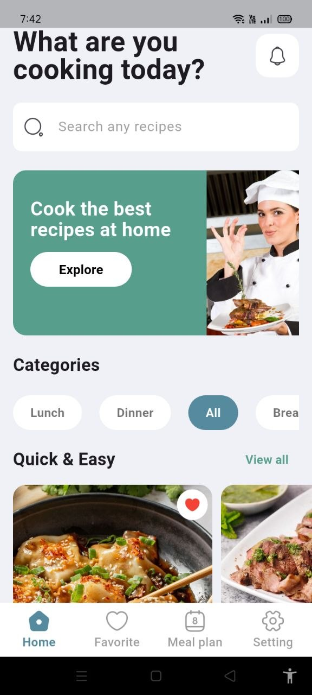
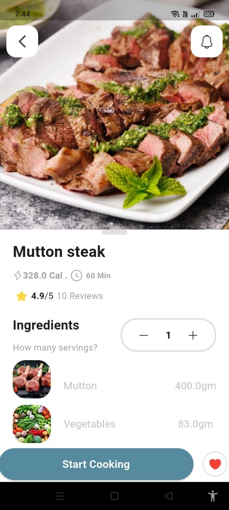
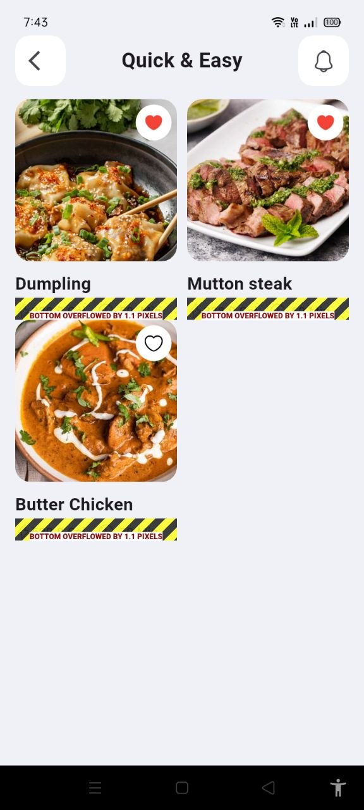
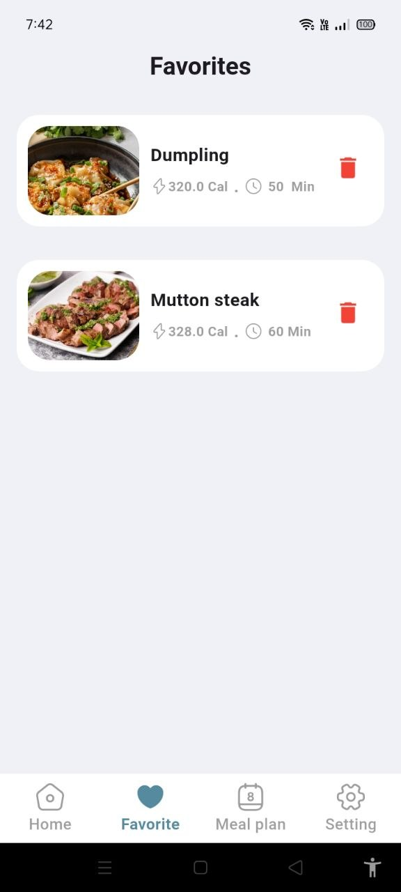
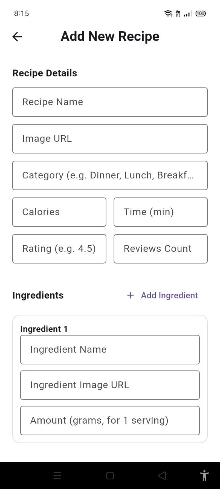
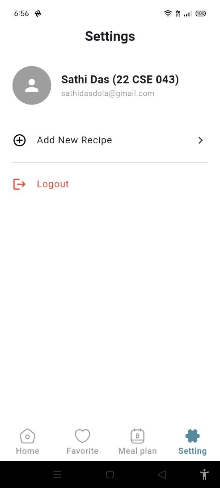
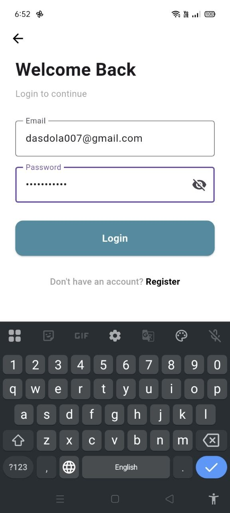
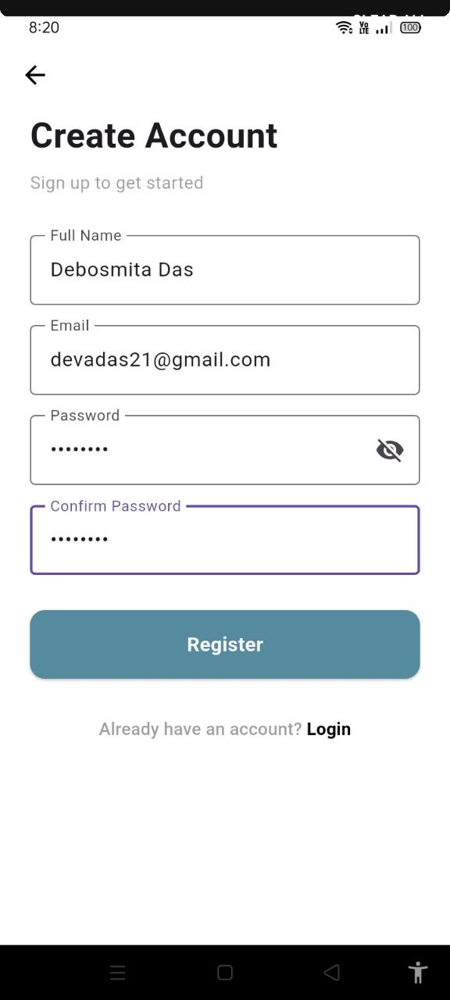
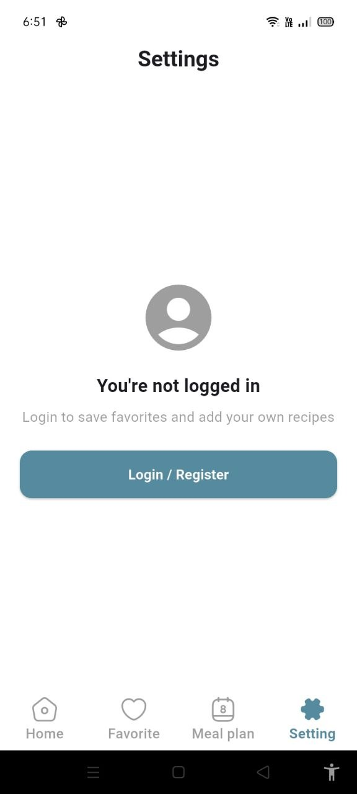

<h1 align="center">🍳 Rannabari Recipe App</h1>

<p align="center">
  A clean and simple Flutter recipe app where you can discover recipes, scale ingredients by servings, save your favorites, and add your own dishes, powered by Firebase.
</p>

<p align="center">
  
  
  
  
</p>

---

## 📖 About

**Rannabari Recipe App** (*Rannabari* means "kitchen" in Bangla) helps home cooks answer one question: **"What are you cooking today?"**

Browse recipes by category, check calories, cooking time and ratings at a glance, and adjust the ingredient quantities to the number of servings you need. Create an account to save your favorite recipes and contribute your own.

---

## ✨ Features

### 🔐 Authentication
- Register with full name, email and password (with confirm password)
- Login with email and password
- Show/hide password toggle
- Guest mode: browse recipes without an account; login is only needed to save favorites and add recipes

### 🏠 Discover Recipes
- Search bar to find any recipe
- Category filter chips (All, Breakfast, Lunch, Dinner, ...)
- **Quick & Easy** section with a "View all" grid view
- Promotional banner with an *Explore* call to action

### 📋 Recipe Details
- Large hero image, recipe name, calories and cooking time
- Star rating with review count
- **Serving selector**: ingredient amounts (in grams) update with the number of servings
- Ingredient list with images
- **Start Cooking** button
- One-tap favorite (heart) button

### ❤️ Favorites
- Save recipes you love and see them in one place
- Remove a recipe from favorites with a single tap

### ➕ Add Your Own Recipe
- Recipe name, image URL, category, calories, time, rating and review count
- Dynamic ingredient list: add as many ingredients as you need (name, image URL, amount in grams per serving)

### ⚙️ Settings & Profile
- Profile with your name and email
- Quick access to *Add New Recipe*
- Logout

---

## 📱 Screenshots

<table>
  <tr>
    <td align="center"><b>Home</b><br></td>
    <td align="center"><b>Recipe Details</b><br></td>
    <td align="center"><b>Quick & Easy</b><br></td>
  </tr>
  <tr>
    <td align="center"><b>Favorites</b><br></td>
    <td align="center"><b>Add New Recipe</b><br></td>
    <td align="center"><b>Settings</b><br></td>
  </tr>
  <tr>
    <td align="center"><b>Login</b><br></td>
    <td align="center"><b>Register</b><br></td>
    <td align="center"><b>Guest Settings</b><br></td>
  </tr>
</table>

---

## 🛠️ Tech Stack

| Category | Technology |
|---|---|
| Framework | [Flutter](https://flutter.dev/) |
| Language | [Dart](https://dart.dev/) (SDK `^3.11.1`) |
| State Management | [Provider](https://pub.dev/packages/provider) |
| Authentication | [Firebase Auth](https://pub.dev/packages/firebase_auth) |
| Database | [Cloud Firestore](https://pub.dev/packages/cloud_firestore) |
| Firebase Core | [firebase_core](https://pub.dev/packages/firebase_core) |
| Icons | [Iconsax](https://pub.dev/packages/iconsax) |

---

## 🚀 Getting Started

### Prerequisites

- [Flutter SDK](https://docs.flutter.dev/get-started/install) (with Dart `^3.11.1`)
- Android Studio or VS Code with the Flutter extension
- A [Firebase](https://console.firebase.google.com/) account
- An emulator or a physical device

### Installation

**1. Clone the repository**

```bash
git clone https://github.com/<your-username>/rannabari_recipe_app.git
cd rannabari_recipe_app
```

**2. Install dependencies**

```bash
flutter pub get
```

**3. Set up Firebase**

1. Create a new project in the [Firebase Console](https://console.firebase.google.com/).
2. Enable **Authentication → Sign-in method → Email/Password**.
3. Create a **Cloud Firestore** database.
4. Connect the app to your Firebase project using the FlutterFire CLI:

   ```bash
   dart pub global activate flutterfire_cli
   flutterfire configure
   ```

   Alternatively, add `google-services.json` to `android/app/` (Android) and `GoogleService-Info.plist` to `ios/Runner/` (iOS).

**4. Run the app**

```bash
flutter run
```

### Build an APK

```bash
flutter build apk --release
```

---

## 🗺️ Roadmap

- [ ] Meal planner (weekly meal plan)
- [ ] Step-by-step cooking mode ("Start Cooking")
- [ ] Notifications
- [ ] Edit and delete your own recipes
- [ ] Image upload instead of image URLs
- [ ] Dark mode

---

## 🤝 Contributing

Contributions, issues and feature requests are welcome!

1. Fork the project
2. Create your feature branch: `git checkout -b feature/amazing-feature`
3. Commit your changes: `git commit -m "Add amazing feature"`
4. Push to the branch: `git push origin feature/amazing-feature`
5. Open a Pull Request

---

## 👤 Author

**Your Name**

- GitHub: [@your-username](https://github.com/your-username)
- LinkedIn: [your-profile](https://www.linkedin.com/in/your-profile)
- Email: your.email@example.com

---

## 📄 License

This project is licensed under the MIT License. See the [LICENSE](LICENSE) file for details.

---

<p align="center">Made with ❤️ and Flutter</p>